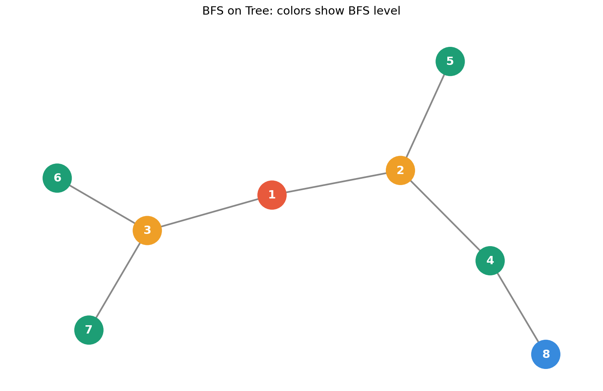
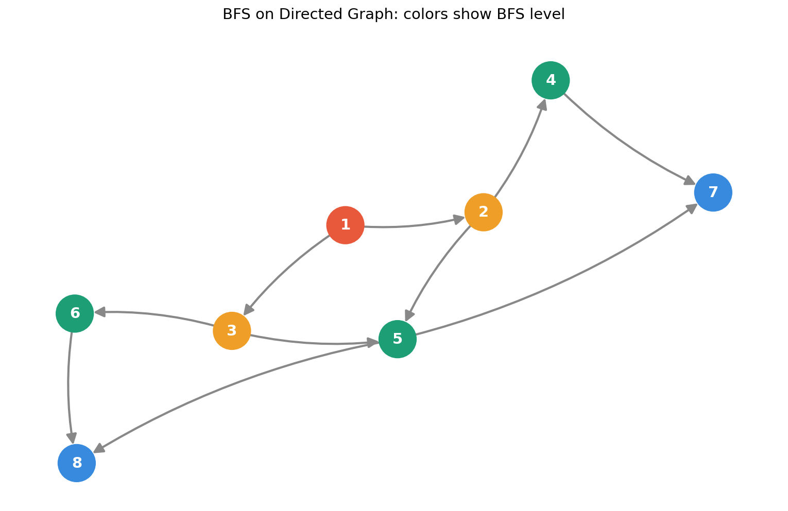

# BFS Graph Learning

A hands-on project to learn **Breadth-First Search (BFS)** algorithm using Python, NetworkX, and Matplotlib in Jupyter Notebook

---

## What is BFS?

BFS (Breadth-First Search) is a graph traversal algorithm, it visits nodes **level by level** starting from a source node, then all its neighbors, then all their neighbors, and so on

---

## Notebooks

| File | Topic | Description |
|------|-------|-------------|
| `01_bfs_tree.ipynb` | BFS on Tree | BFS traversal on an undirected tree |
| `02_bfs_directed_graph.ipynb` | BFS on Directed Graph | BFS traversal following edge directions |

---

## Visualizations

### BFS on Tree

### BFS on Directed Graph

---

## How to Run

1. Clone this repository

   git clone https://github.com/rbbieee/bfs-graph-learning.git

2. Go into the project folder

   cd bfs-graph-learning

3. Create and activate virtual environment

   python -m venv venv
   source venv/bin/activate

4. Install dependencies

   pip install -r requirements.txt

5. Open Jupyter Notebook

   jupyter notebook

6. Run the notebooks inside the `notebooks/` folder

---

## Tech Stack

- Python 3
- NetworkX
- Matplotlib
- Jupyter Notebook

---

## What I Learned

- How BFS works step by step
- Difference between undirected and directed graphs
- How to use `graph.neighbors()` vs `graph.successors()`
- How to visualize graphs with color-coded BFS levels